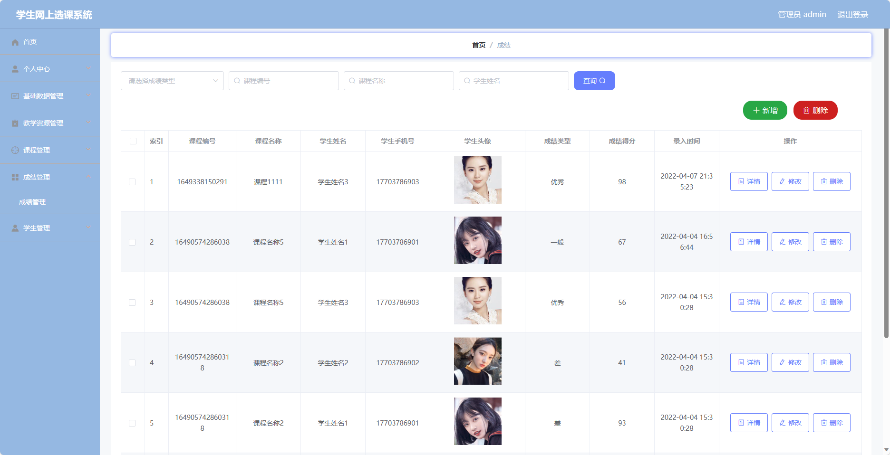

基于SpringBoot的学生网上选课系统（程序+论文）
=
- 完整代码获取地址：从戎源码网 ([https://armycodes.com/](https://armycodes.com/))
- 作者微信：19941326836  QQ：952045282 
- 承接计算机毕业设计、Java毕业设计、Python毕业设计、深度学习、机器学习
- 选题+开题报告+任务书+程序定制+安装调试+论文+答辩ppt 一条龙服务
- 所有选题地址https://github.com/nature924/allProject

一、项目介绍
---
基于Spring Boot框架实现的学生网上选课系统，系统包含三种角色：管理员、老师、学生,系统分为前台和后台两大模块，主要功能如下
### 管理员：
个人中心：管理个人信息，包括修改个人信息、查看选课记录等。
基础数据管理：管理系统的基础数据，包括学院信息、专业信息、班级信息等。
教学资源管理：管理教学资源，包括上传、下载课件、资料等。
课程管理：管理课程信息，包括添加、编辑、删除课程等操作。
成绩管理：管理学生成绩，包括录入、修改、查询成绩等操作。
学生管理：管理学生信息，包括添加、编辑、删除学生等操作。

### 老师：
个人中心：管理个人信息，包括修改个人信息、查看选课记录等。
教室管理：管理教室信息，包括查看教室占用情况、修改教室信息等操作。
课程管理：管理课程信息，包括添加、编辑、删除课程等操作。
成绩管理：管理学生成绩，包括录入、修改、查询成绩等操作。

### 学生：
个人中心：管理个人信息，包括修改个人信息、查看选课记录等。
教室管理：管理教室信息，包括查看教室占用情况、选择合适的教室等操作。
课程管理：管理已选课程信息，包括退选课程、查询已选课程等操作。
成绩管理：查看自己的成绩信息。

二、项目技术
---
- 编程语言：Java
- 数据库：MySQL
- 项目管理工具：Maven
- 前端技术：VUE、HTML、Jquery、Bootstrap
- 后端技术：Spring、SpringMVC、MyBatis

三、运行环境
---
- 操作系统：Windows、macOS都可以
- JDK版本：JDK1.8以上都可以
- 开发工具：IDEA、Ecplise、Myecplise都可以
- 数据库: MySQL5.7以上都可以
- Tomcat：任意版本都可以
- Maven：任意版本都可以

四、运行截图
---
### 论文截图：

### 程序截图：

